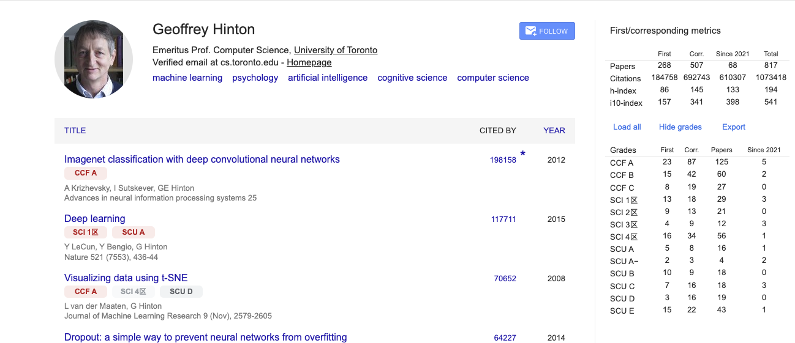

# Google Scholar 一作/通讯指标插件

[](#)
[](#)
[](#license)

一个 Chrome 浏览器扩展，用于增强 Google Scholar 作者主页，自动展示一作、通讯作者近似指标，以及论文的期刊/会议评级信息。




## 功能

### 📊 作者指标增强

在 Google Scholar 原有统计信息基础上，增加：

* **First**：作者作为第一作者的论文及相关指标；
* **Corr.**：作者作为尾作者的论文，用于近似统计通讯作者；
* **Since**：近五年窗口内的论文数量及 Google Scholar 原生引用指标；
* **Total**：全部论文统计。

支持展示：

* Papers
* Citations
* h-index
* i10-index

### 🏷️ 论文评级徽章

自动识别论文所属期刊或会议，并在论文条目下方显示评级：

* **CCF A / B / C**
* **SCI 中科院 1–4 区**
* **四川大学期刊分级 A–E**

不同等级使用不同颜色，高等级论文更加突出。

### 📈 Grades 统计面板

按照不同评级汇总作者论文，包括：

* First Author 数量
* Corresponding Author（尾作近似）数量
* 总论文数量
* Since 窗口内论文数量


### 📥 数据导出

支持导出：

```text
scholar-venue-grades.csv
```

包含：

* 各评级等级汇总；
* 每篇论文的作者角色；
* 论文评级；
* 匹配结果。

### 🔄 自动加载全部论文

点击 **Load all** 后，扩展会自动展开 Google Scholar 作者主页中的全部论文。

对于作者信息或论文载体信息被截断的情况，扩展会自动补全论文详情，以提高作者角色和期刊/会议匹配的准确性。

---

## 核心技术

### 1. 本地数据处理

所有统计和期刊/会议匹配均在浏览器本地完成，不向 Google Scholar 发送额外的数据请求。

期刊和会议评级数据经过预处理后构建为本地索引，实现快速匹配。

### 2. 作者角色识别

扩展读取 Google Scholar 作者主页中的论文作者列表，并根据目标作者的位置判断：

* 第一位 → **First Author**
* 最后一位 → **Corr. Author Approximation**

由于 Google Scholar 不直接标注通讯作者，因此尾作者仅作为通讯作者的近似统计。

### 3. 期刊与会议匹配

针对 Google Scholar 中格式不统一的论文载体信息，匹配过程采用：

1. 会议名称优先匹配；
2. 期刊名称匹配；
3. 对名称进行归一化处理后再次匹配。

匹配过程中会忽略大小写、空格和部分常见格式差异，并支持会议全称与简称匹配。

---

## 项目结构

```text
.
├── manifest.json
├── data/
│   ├── dataset.json
│   └── dist/
│       └── venue-index.json
├── scripts/
│   ├── build-venue-index.js
│   └── profile-parser.js
├── src/
│   ├── content/
│   ├── background/
│   ├── popup/
│   └── options/
├── styles/
└── tests/
```

核心模块包括：

* **content**：Google Scholar 页面解析、指标计算与 UI 注入；
* **data**：期刊、会议及评级数据；
* **scripts**：数据索引构建与离线解析；
* **popup / options**：扩展交互与配置；
* **tests**：匹配规则回归测试。

---

## 安装

1. 下载或克隆本项目；
2. 打开 Chrome：

```text
chrome://extensions
```

3. 开启 **开发者模式**；
4. 点击 **加载已解压的扩展程序**；
5. 选择项目根目录；
6. 打开任意 Google Scholar 作者主页。

例如：

```text
https://scholar.google.com/citations?user=...
```

---

## 构建与测试

当期刊或会议数据更新后：

```bash
npm run build:venues
```

运行离线测试：

```bash
npm test
```

---

## 数据来源

评级数据基于以下公开数据整理：

* 川大分级数据来源：《高质量科技期刊及学术会议分级参考方案（暂行）（2021）》
* CCF 分级数据来源：《第七版中国计算机学会推荐国际学术会议和期刊目录（2026）》
* 中科院分级数据来源：中国科学院期刊分区 2025 年版

所有数据经过本地预处理后随扩展使用。

---

## 已知限制

* Google Scholar 不提供通讯作者字段，因此 **Corr.** 采用尾作者进行近似；
* Google Scholar 大多数时候都没有共一标识，因此该插件无法统计共一。
* 部分形式的期刊或会议名称可能无法准确匹配；
* Google Scholar 页面结构变化可能影响 DOM 解析，需要相应更新扩展。


可以，在 README 最后加一个简洁的 **Contributing** 部分即可，比较符合开源项目的风格：

## 🤝 Contributing

欢迎任何形式的贡献！

如果你发现：

* 期刊或会议匹配存在问题；
* Google Scholar 页面兼容性出现异常；
* 评级数据需要补充或更新；
* 有新的功能建议或改进思路；

欢迎提交 **Issue** 或 **Pull Request**。

无论是修复 Bug、完善数据、优化匹配规则，还是提出新的想法，都非常欢迎参与这个项目。

如果这个项目对你有帮助，也欢迎 ⭐ Star 支持！


---

## License

[MIT](LICENSE)
